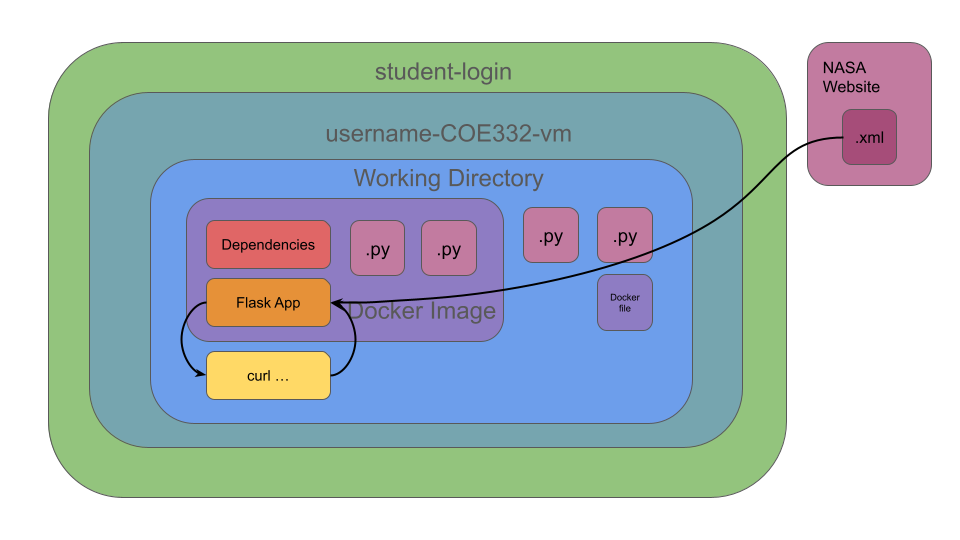

# International Space Station Tracker Flask App

### Overview

This project involves tracking the International Space Station by fetching data from NASA's website and analyzing various parameters (range, closest epoch, average speed, instantaneous speed, location, etc.) in Python. This is also a Flask app, enabling data to be requested and sent over the internet. The data can be accessed from this link, however the program will access it automatically: https://nasa-public-data.s3.amazonaws.com/iss-coords/current/ISS_OEM/ISS.OEM_J2K_EPH.xml

### Scripts
`iss_tracker.py`
This script contains functions for fetching, formatting, and analyzing the ISS data, alongside creating the Flask app.
`test_iss_tracker.py`
This is the pytest file for `iss_tracker.py`.

### Running the Code
#### Non-Containerized
1. Make sure Python3 and necessary dependencies (viewable in requirements.txt) are installed on your computer.
2. Download or clone this repository into a directory.
3. Run the main script (`iss_tracker.py`) and/or the test script (`test_iss_tracker.py`). *(NOTE: You MUST run `iss_tracker.py` first to set up the flask app that is requested by `test_iss_tracker.py`)*
4. See Flask Interaction below
#### Containerized
1. Make sure Docker is intalled on your computer
2. Download or clone this repository into a directory.
3. In the directory, run `docker-compose up` And wait for the Docker image to generate and for the Flask app to start.
4. To check things are up and running, in a separate terminal window run `docker ps -a`
5. See Flask Interaction below
6. To run unit tests, navigate to the `test` directory and run `pytest`. This involves testing some of the Flask app functions, so the container MUST be up and running for this to work.

### Flask Interaction
You can interact with the flask app via `curl localhost:5000/<route>` once it is up and running.

| Route                   | Description                                               |
|-------------------------|-----------------------------------------------------------|
| /comment | Returns comment list object |
| /header | Returns header dictionary object |
| /metadata | Returns metadata dictionary object |
| /epochs | Returns formatted epochs data                                    |
| /epochs?limit=int&offset=int | Formatted epochs data starting at `offset` with `limit` entries  |
| /epochs/\<epoch\> | Returns state vector for a specific Epoch timestamp (format: `YYYY-MM-DD__HH_MM_SS.SSSSSS`)  |
| /epochs/\<epoch\>/speed | Returns instantaneous speed for a specific Epoch timestamp (format: `YYYY-MM-DD__HH_MM_SS.SSSSSS`) |
| /epochs/\<epoch\>/location | Returns latitude, longitude, altitude, and geolocation for a specific Epoch timestamp (format: `YYYY-MM-DD__HH_MM_SS.SSSSSS`) |
| /now | Returns state vectors, location info, and instantaneous speed for the nearest Epoch |

### Interpretation
- The `fetch_data()` function fetches the ISS data from NASA's website.
- The `format_data()` function parses the XML data into a list of dictionaries, each representing a state vector of the ISS at a specific timestamp.
- The `format_header()` function grabs the header data from the unformatted dictionary.
- The `format_comment()` function grabs the comment data from the unformatted dictionary.
- The `format_metadata()` function grabs the metadata data from the unformatted dictionary.
- The `calculate_data_range()` function calculates the range of data based on the first and last timestamps.
- The `find_closest_epoch()` function finds the epoch closest to the current time.
- The `calculate_average_speed()` function computes the average speed of the ISS using the formatted data.
- The `calculate_instantaneous_speed()` function calculates the instantaneous speed of the ISS at the closest epoch.
- The `cartesian_to_geo()` function calculates the latitude, longitude, altitude, and geoposition given a specific epoch.

### Diagram

